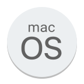
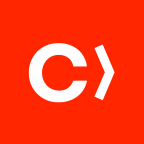

<h1 align="center">Hi 👋, I'm Vinicius Moraes da Silva</h1>

  

 🔭 I’m currently working on **Itaú Unibanco**   🇧🇷 Professional with over **11 years of experience** in the IT field with projects in the financial sector   📝 I’m currently learning **Swift**   💬 Ask me about **Swift, Amazon AWS, Cobol...**  
 

 📫 How to reach me:  
  

    
    
    
    
  

<h2 align="left">Core Stacks and Tools:</h2>

  
  
  
  
  
  

 

  
  
  
  
  
  
  

<h2 align="left">Certifications:</h2>

  
  
  
  
  

